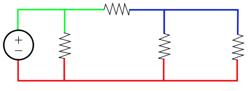
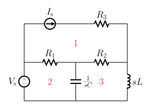

# Terminology 

## Components/elements
An example of what a component/element is: A resistor, capacitor, inductor, diode, transistor, etc.

## Circuit 
A circuit is a closed loop of conductors through which electric current can flow.

 

Source: [wikipedia](https://en.wikipedia.org/wiki/Electrical_network)

## Node
A node is a point where two or more Circuit elements/components are connected together that have the same voltage. Another name for this is a junction.

 

Source: [wikipedia](https://en.wikipedia.org/wiki/Node_(circuits))

## Branch 

A branch is a component/element that splits a node into two or more nodes. The reason this is done because it has a different voltage than the other node. 

## Mesh
The term mesh can be thought about as a screen door where it has open holes in it. The mesh is those open holes.

The meshes can be picked by following the branches until they lead back to the original node.

Source: [wikipedia](https://en.wikipedia.org/wiki/Mesh_analysis)

As you can see this circuit has 3 meshes.

## Loop
The previouse term [mesh](/Circuit%20elements/Terminology.md#mesh) can also be called a loop. 
A loop is a path that starts and ends at the same node. and it can be bigger than just one small section of the circuit.

