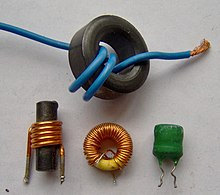

# Inductors In Depth

## What Does a Inductor Do?
An inductor is a passive electronic component which is capable of storing electrical energy in the form of magnetic energy.

## How to find the inductance of a inductor
To find the inductance of a inductor is by using a multimeter. You can see the chart below for how to read the inductance of a inductor.

# Go back
[Go back to Basic Elements](/Circuit%20elements/Basic-Elements.md)