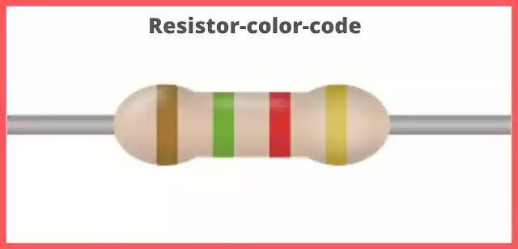
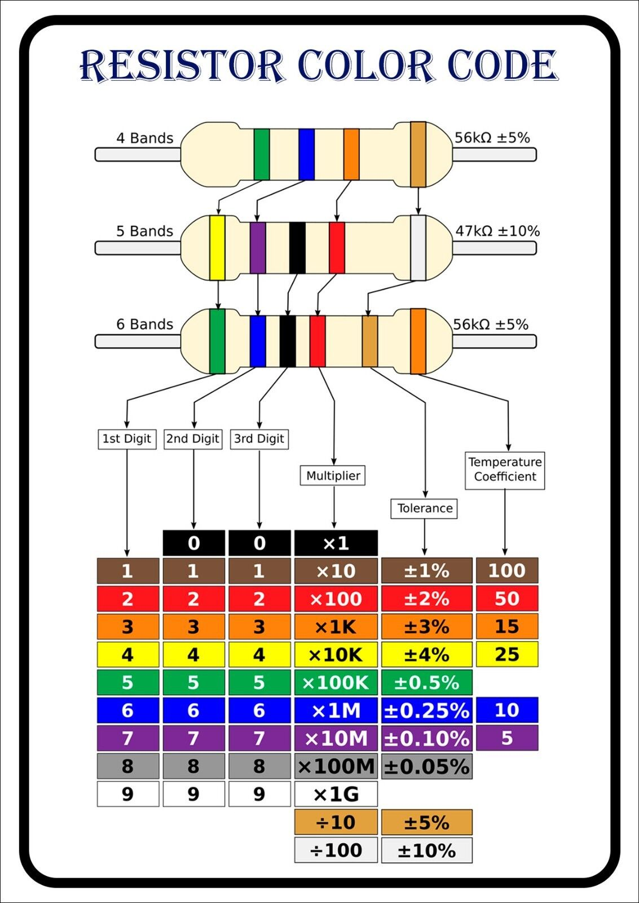

# Resistors In Depth

Source: [atlearner](https://www.atlearner.com/2019/07/Resistor-color-code.html)

## How to find the resistance of a resistor 

To find the resistance of a resistor is by checking the color bands on the resistor, or by using a multimeter. You can see the chart below forhow to read the color bands on a resistor.

Source: [atlearner](https://www.atlearner.com/2019/07/Resistor-color-code.html)

# Go back
[Go back to Basic Elements](/Circuit%20elements/Basic-Elements.md)