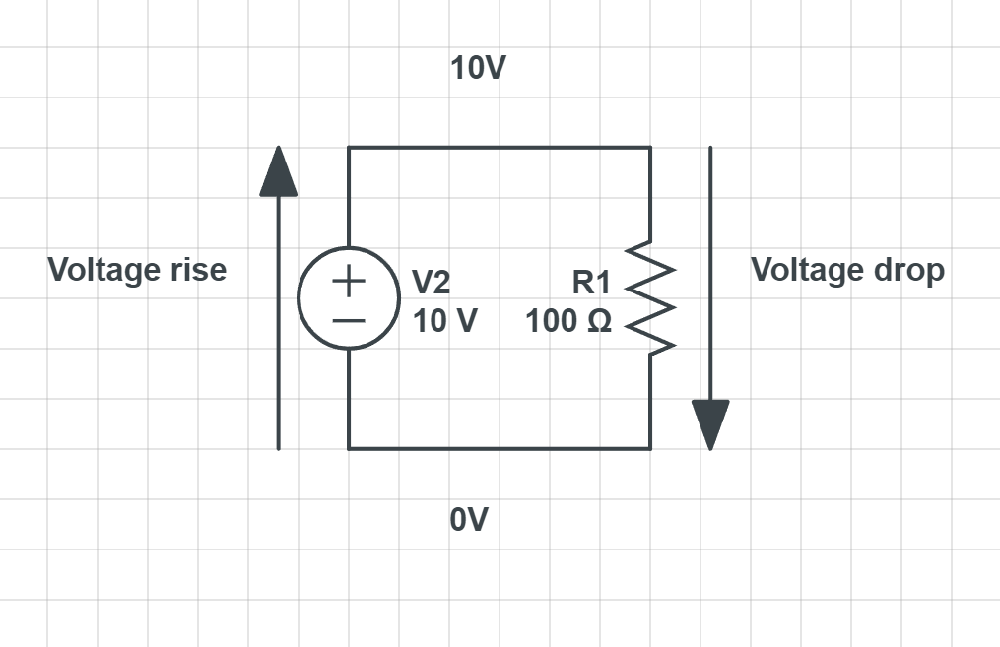

# Kirchhoff Laws 
The Kirchhoff's laws are two important laws in circuit analysis. They are named after Gustav Kirchhoff, a German physicist. The laws are as follows:

1. Kirchhoff's Current Law (KCL)
2. Kirchoff's Voltage Law (KVL)

## Kirchhoff's Current Law (KCL)
All current that flows into a node must equal the current that flows out of the node. 

This means that if we have to resistors in series, the current flowing through both of them must be the same.

`ΣIin = ΣIout` 

In the image above, the current flowing through the first resistor is equal to the current flowing through the second resistor.

## Kirchhoff's Voltage Law (KVL) 

Changes in voltage can be called voltage rises and voltage drops. Voltage rises are positive and voltage drops are negative. 

In this image you can see that the voltage rise is -10V and the voltage drop is 10V. 

The sum of voltage rise - the sum of voltage drop  must equal 0. 

`ΣVrise - ΣVdrop = 0`

# Nextup  
[Node Voltage Analysis](Node-voltage-analysis.md) 
