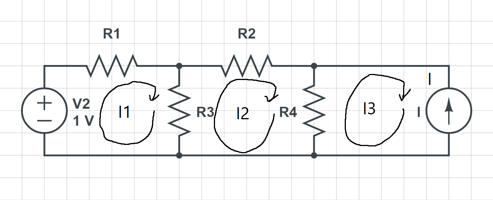

# Mesh Current Analysis

Mesh Current Analysis is another method of getting the currents in a circuit. We already know what the term mesh is from the [previous chapter](/Circuit%20elements/Terminology.md). So we will just get the current from each of the meshes in our circuit.

## Steps of Mesh Current Analysis

1. Draw the mesh currents. 
2. Solve the easy meshes.
3. Write KVL(Kirchhoff's voltage law) equations. 
4. Solve
   
## Example

### Step 1: Draw the mesh currents

### Step 2: Solve the easy meshes

Since I3 is going in the opposite direction of I we know that I3 = -I

### Step 3: Write KVL equations

#### Mesh 1: 
First we start with the voltage source. which is a voltage rise.

So we start off with `V`

Next we come to a resistor. So we add the voltage drop across the resistor to the equation. `V - R1 * I1`

Next we come across another resistor so we add another voltage drop to the equation. `V - R1 * I1 - R2(I1 -I2)`

And finnaly we return to where we started so we set it equal to zero. `V - R1 * I1 - R2(I1 -I2) = 0`

#### Mesh 2:

We start off with a voltage rise so we start off with `+ R2(I1 - I2)`

Next we come across a resistor so we add the voltage drop across the resistor to the equation. `+ R2(I1 - I2) - R3 * I2` 

Next we come across another resistor so we add another voltage drop to the equation. `+ R2(I1 - I2) - R3 * I2 - R4(I2 - I3)`

And we will set it to 0 since we are returning to where we started. `+ R2(I1 - I2) - R3 * I2 - R4(I2 - I3) = 0`

### Step 4: Solve

#### Cleaning up the equations
Now that we have our equations for each of the mshes we can solve them. 

First lets clean up the first equation.
`-(R1 + R2)I1 + R2 * I2 = -V`

Next lets clean up our second equation.

`+R2 * I1 - (R2 + R3 + R4) * I2 + R4 * I3 = R4 * I`

Just for making this a little easier to understand  I am going to add values to all of the resistors and the voltage source. 

This will give us the following equations.

`-3 * I1 + 2 * I2 = -5`

`2 * I1 - 8 * I2 = 6`

#### Solving for I1

To solve this we can multiply the first equation by 4 and then add it to the second equation. 

`4 * (-3 * I1 + 2 * I2  = -5) + 2 * I1 - 8 * I2 = 6` = `-10 * I1 = 14`

this means that I1 is equal to `14/10` which is `1.4ma`

#### Solving for I2
Since we know have the current for I1 we can solve I2 using the equation `2 * I1 - 8 * I2 = 6`

Now we can solve for I2 

`-8 * I2 = 6 - 2.8`

`I2 = 3.2 / -8` or `I2 = -0.4ma`

### Conclusion

We have figued out the current in each of the meshes.

Mesh 1: `I1 = 1.4ma`

Mesh 2: `I2 = -0.4ma`

Mesh 3: `I3 = -2ma` 

Now lets see what the current flowing through resistor R2 is.

`IR2 = I1 - I2` 

We can now substitute in the values we found for I1 and I2

`IR2 = 1.4 - (-0.4)`

`IR2 = 1.8ma`

