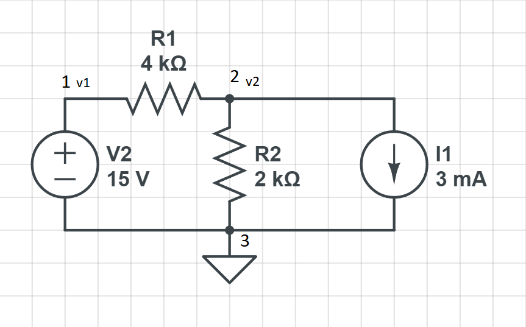

# Node Voltage Analysis

Node voltage is a method of analyzing circuits that uses Kirchhoff current law. The term node voltage refers to the voltage at a node. A node is a point where two or more wires meet. We also have branch voltage which is the voltage across a branch/element.

The first thing you need is a refrerence node. We should use a node that either is where the battery is connected or where many branches meet. To mark your reference node, you will add a ground symbol to it. 

## Steps of Node Voltage Analysis 

1. Find the reference node.
2. Name the node voltages.
3. Solve for easy nodes.
4. Write KCL(Kirchhoff's current law) equations.
5. Solve for the unknown node voltages.

## Example 

### Step 1 & 2: Find the reference node & Name the node voltages

In this image we  have added our reference node. We have also named our node voltages

### Step 3: Solve for easy nodes
A easy node that is connected directly connected to a source.

Just by looking at the image we can see that node 1 is easy to solve. Since the node is connected directly to the source, we can just name the node voltage as the source voltage.

### Step 4: Write KCL equations

First we have to add the currents to our nodes. 

Now we can write our KCL equations.

KCL: `i1 - i2 - is = 0`

`v1 - v2 / R1 - i2 - v2 / R2 - is = 0` 

### Step 5: Solve for the unknown node voltages

Next we can replace variables

1. `v1 - v2 / R1 - v2/ R2 -  Is = 0`

2. `15v / 4k - vs / 4k - v2 / 2k = 3mA`

3. `-v2(1/4k + 1/2k) = 3mA - 15v/4k`

4. `-v2(1+2/3k) = 3mA - 3.75mA`

5. `-v2 = -0.75mA * 4k/3`

Finally we can solve for `v2`
`v2 = 1v`

# Next up 
[Mesh Current Analysis](Mesh-current-analysis.md) 
