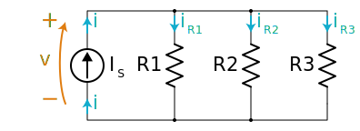

# Parallel Resistors 

Source: [Khanacademy](https://www.khanacademy.org)

A Parallel resistor circuit is when 2 or more resistors are connected and share the same node. They all share the same voltage, but the current is different.
The current will change when the path splits between the resistors. And then the current will add up when the paths merge again. 

## How to calculate a replacment resistor 

To calculate a replacment resistor that is in parallel is with the equation `1/Rp = 1/R1 + 1/R2 + 1/R3 + ...`.

Lets say we have 2 resistors, R1 = 80Ω and R2 = 100Ω. and they are in parallel we can calculate the replacment resistor with the equation below. 

`1/Rp = 1/80 + 1/100`

First we will have to get the common denominator which is 400.

`1/Rp = 5/400 + 4/400`

Then we will add the fractions together.

`1/Rp = 9/400`

Then we will have to invert the fraction. 

`Rp = 400/9` 

This will then give us the replacment resistor which is `44.44Ω`.

## Try it yourself  

Example 1: What is the total current of the circuit?  

This circuit has 2 resistors, R1 = 20Ω and R2 = 60Ω. and they are in parallel
This circuit also has a battery with 3V.

<image src="../assets/parallel-resistor-quiz.png" width="400px">

Answer: Replacment resistor

 15Ω

Answer: Total Current

    200ma

 

# Next up

[Simplifying Resistors](Simplifying-resistors.md)