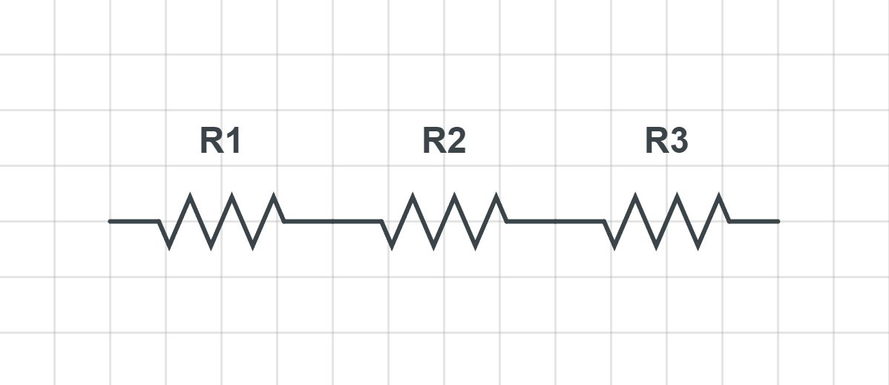

# Series Resistors 

A Series resistor connection is when resistors are connected from head to tail. They all share the same current, but the voltage is different. 

## How to calculate the total resistance 

The total resistance is the sum of all the resistors in the circuit. 

Using the example circuit above, the total resistance if R1 = 1kΩ and R2 = 2kΩ and R3 = 3kΩ is: 6kΩ  

## How to calculate the voltage after each resistor 

Since we would like to know the voltage after each resistor, we can use Ohm's law to calculate the voltage. The data we need is the resistance and the current.

The equation to get the voltage is `V = IR`. 

## What happens to the total voltage 

The total voltage is the same as the voltage before the first resistor. 

## How to calculate the current 

To calculate the current we will use the equation `I = V / Rtotal`.

## Try it yourself  

Example 1: Calculate the total resistance, the voltage after each resistor and the current. 

Resistors: R1 = 100Ω, R2 = 50Ω, R3 = 150Ω 
Battery: 1.5V 

Answer: Total Resistance

300Ω

Answer's: Voltage After Each Resistor

After R1: 0.5V
 
After R2: .25V
 
After R3: .75V

Answer: Currrent of circuit

0.005A

 

# Take aways 

- The total resistance is the sum of all the resistors in the circuit. `Rtotal = R1 + R2 + R3 + ...`
- The total voltage is the same as the voltage before the first resistor.
- The current is the same for all the resistors in the circuit.
- The voltage after each resistor is calculated using Ohm's law. `V = IR`
- To calculate the current, we divide the total voltage by the total resistance. `I = V / Rtotal`

# Next up

[Parallel Resistors](../Parallel-resistors.md)

