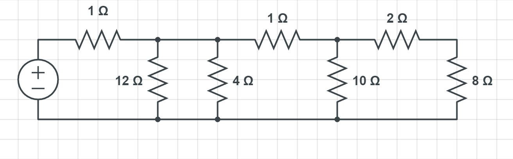
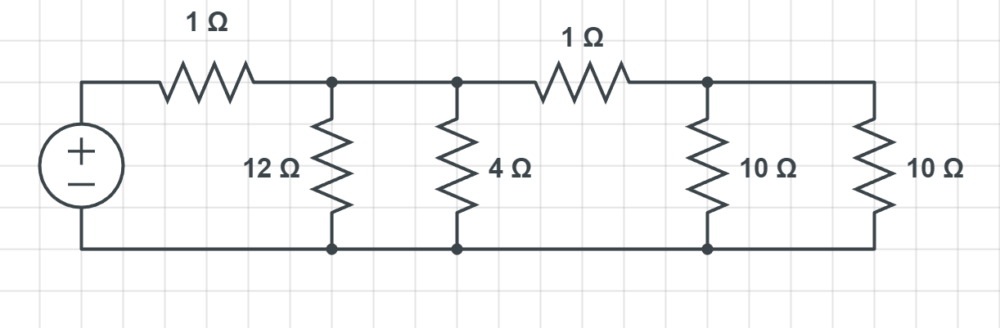
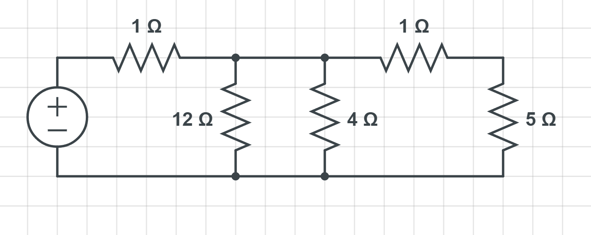
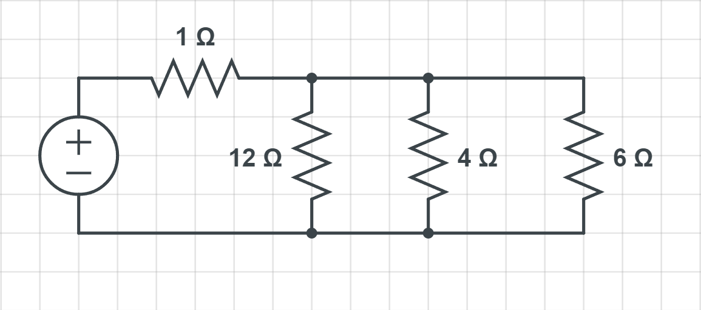
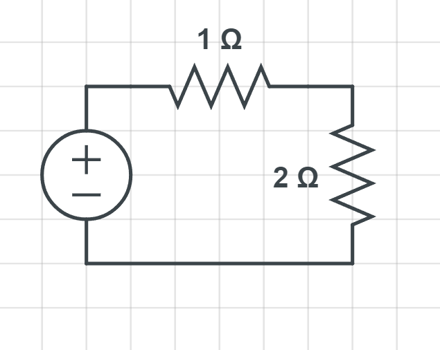
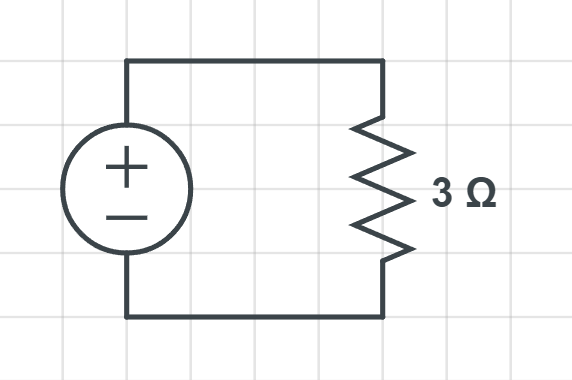

# Simplify Resistor Circuits  

When you have a circuit with multiple resisors, you are able to simplify the circuit. This is done by combining the resistors in the circuit.
We were doing some of this in the previous pages but now we will be doing this in a full circuit.

## Simplifying a circuit

We are going to start with the following circuit: 

The first thing that we are going to simplift is the far right resistors. We can add them together since they are in series which will give us 10Ω. 

Now we have 2 10Ω resistors in parallel. We can add them together to get 5Ω.
We can use the following equation to find the total resistance of resistors in parallel: `10 * 10 / 10 + 10 = 5Ω`

Now we have 2 resistors in series, one is of them is 5Ω and the other is 1Ω we can add them together to get 6Ω.

Now we have 3 resistors in parallel, we can use the following equation to find the total resistance of resistors in parallel: `1/12 + 1/4 + 1/6 =  1/12 + 3/12 + 2/12 = 1/2 or 2Ω`

Finally we have 2 resistors in series, one is of them is 2Ω and the other is 1Ω we can add them together to get 3Ω.

# Next Up

[Voltage divider](Voltage-divider.md)