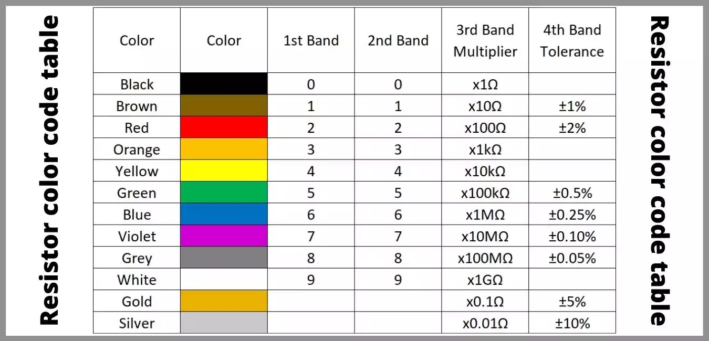

# Resistors In deapth

## How to find the resistance of a resistor 

To find the resistance of a resistor is by checking the color bands on the resistor, or by using a multimeter. You can see the chart below forhow to read the color bands on a resistor.

